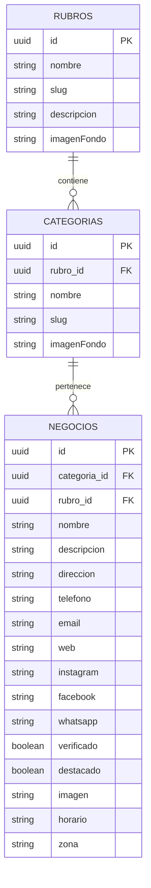

# CLASIFK2
> **"El que busca encuentra"** — Guía comercial, industrial y de servicios para la ciudad de Chivilcoy, pueblos aledaños y zonas de influencia.

Este proyecto es una plataforma web moderna diseñada bajo una estética **Neo-brutalista** robusta, colorida y de alto impacto visual. Permite a los usuarios explorar rubros, categorías y fichas técnicas completas de comercios verificados y destacados, facilitando la conexión directa a través de WhatsApp y otros canales de comunicación.

---

## 🚀 Tecnologías Utilizadas

La aplicación está construida sobre un stack moderno y eficiente enfocado en el rendimiento y la experiencia de usuario:

*   **Core / Framework**: [Next.js v16.2.9](https://nextjs.org/) (usando el modelo de enrutamiento *App Router*).
*   **Librería Principal**: [React v19.2.4](https://react.dev/).
*   **Estilos**: [TailwindCSS v4](https://tailwindcss.com/) (con integración PostCSS) para un maquetado moderno y flexible.
*   **Base de Datos / Backend-as-a-Service**: [@supabase/supabase-js v2.110.2](https://supabase.com/) para consultas en tiempo real y almacenamiento estructurado.
*   **Iconografía**: [Lucide React v1.24.0](https://lucide.dev/) para iconos vectoriales limpios y responsivos.
*   **Lenguaje**: [TypeScript v5](https://www.typescriptlang.org/) para tipado estático y desarrollo seguro.

---

## 🛠️ Requisitos e Instalación

### Requisitos Previos

Asegúrate de tener instalado en tu sistema:
*   [Node.js](https://nodejs.org/) (versión 18.x o superior recomendada).
*   [npm](https://www.npmjs.com/) (incluido con Node.js).

### Pasos para la Instalación

1.  **Clonar el repositorio**:
    ```bash
    git clone https://github.com/JosueGaticaOdato/Clasifk2.git
    cd clasifk2
    ```

2.  **Instalar las dependencias**:
    ```bash
    npm install
    ```

3.  **Configurar las Variables de Entorno**:
    Crea un archivo `.env.local` en la raíz del proyecto y añade tus credenciales de Supabase (puedes tomar como base el archivo `.env` si estuviera disponible):
    ```env
    NEXT_PUBLIC_SUPABASE_URL=https://tu-proyecto-supabase.supabase.co
    NEXT_PUBLIC_SUPABASE_PUBLISHABLE_KEY=tu-anon-key-de-publicacion-supabase
    ```

4.  **Ejecutar en Entorno de Desarrollo**:
    Para levantar el servidor local de desarrollo:
    ```bash
    npm run dev
    ```
    *Nota: Si necesitas levantar el proyecto en un puerto específico (por ejemplo, el puerto 3001), puedes correr:*
    ```bash
    npm run dev -- --port 3001
    ```
    Abre [http://localhost:3001](http://localhost:3001) en tu navegador para ver la aplicación.

5.  **Compilar para Producción**:
    Para crear una compilación optimizada para producción:
    ```bash
    npm run build
    ```
    Para iniciar el servidor con el código compilado:
    ```bash
    npm run start
    ```

---

## 🗄️ Estructura de la Base de Datos (Supabase)

El modelo de datos está estructurado en base a una jerarquía relacional que conecta rubros generales con categorías específicas, y estas a su vez con los comercios o negocios individuales (según el diagrama de entidad-relación `DER.drawio`):



### Detalle de las Tablas principales

1.  **`rubros`**: Sectores macro de la economía y servicios (ej. *Gastronomía*, *Construcción*, *Salud*, *Automotores*).
2.  **`categorias`**: Agrupaciones específicas dentro de cada rubro (ej. *Pizzerías*, *Ferreterías*, *Dentistas*, *Mecánicos*). Se vinculan a un `rubro_id`.
3.  **`negocios`**: Fichas de los comercios. Cada negocio contiene datos de contacto directo, imágenes, ubicación, horarios de atención y banderas de estado (`verificado` y `destacado`).

---

## 🗺️ Guía de Rutas (App Router)

El sistema de enrutamiento dinámico define las siguientes secciones:

*   **`/` (Inicio)**: Landing page con el buscador principal brutalista. Muestra los rubros disponibles en la plataforma con paginación integrada (6 rubros por página).
*   **`/rubro/[slug]`**: Lista de categorías asociadas al rubro seleccionado. Si un rubro no posee categorías asociadas en la base de datos, redirige automáticamente a la vista directa de negocios.
*   **`/categoria/[[...slug]]`**: Enrutamiento flexible (catch-all) que opera de la siguiente manera:
    *   **Búsqueda General**: Si recibe el parámetro query `?search=texto`, realiza una consulta en Supabase combinando coincidencias tipográficas (`ilike`) en nombres de negocios, descripciones, categorías y rubros.
    *   **Vista de Categoría**: Muestra el listado de negocios pertenecientes a la categoría solicitada por su `slug`.
    *   **Vista de Rubro Alternativa**: Si el `slug` pertenece a un rubro, lista directamente todos los negocios de ese rubro.
*   **`/negocio/[id]`**: Ficha técnica interactiva del negocio. Muestra imágenes, descripción, horarios, dirección y enlaces a redes sociales o sitios web. Incluye un botón de acción principal para **Contactar por WhatsApp** con un texto predefinido personalizado.
*   **`/quienes-somos`**: Sección institucional que describe los valores y el origen de CLASIFK2.
*   **`/revista`**: Información informativa sobre dónde adquirir la edición física y digital de la revista comercial.
*   **`/donde-llega`**: Mapa e información de cobertura publicitaria (abarcando Chivilcoy, Alberti, Mercedes, Suipacha, Luján, Bragado, Chacabuco, CABA y Costa Atlántica).
*   **`/compromiso`**: Declaración de compromisos éticos con los lectores y anunciantes de la guía.

---

## 📂 Estructura del Código Fuente

La arquitectura del proyecto sigue una convención limpia y modular dentro del directorio `src/`:

```text
src/
├── app/                  # Páginas, layouts y estilos globales (App Router)
│   ├── categoria/        # Catch-all de búsqueda y negocios por categoría
│   ├── compromiso/       # Página estática de compromiso
│   ├── donde-llega/      # Página de cobertura geográfica
│   ├── negocio/          # Vista detallada de cada comercio ([id])
│   ├── quienes-somos/    # Página de presentación
│   ├── revista/          # Guía de distribución de la revista
│   ├── rubro/            # Listado de categorías por rubro ([slug])
│   ├── globals.css       # Configuración de TailwindCSS, tipografías y estilos neo-brutalistas
│   ├── layout.tsx        # Layout general del sitio (Navbar, Footer, Sticker flotante)
│   └── page.tsx          # Página de inicio
├── components/           # Componentes UI reutilizables
│   ├── cards/
│   │   └── CardNegocio.tsx  # Tarjeta brutalista para la visualización de comercios
│   ├── layout/
│   │   ├── Footer.tsx       # Pie de página neo-brutalista
│   │   └── Navbar.tsx       # Barra de navegación superior
│   ├── BackButton.tsx    # Botón dinámico para volver atrás en el historial
│   └── Search.tsx        # Formulario cliente de búsqueda
├── lib/
│   └── supabase.ts       # Inicialización y exportación del cliente Supabase
├── services/             # Capa de peticiones de datos (Data Fetching)
│   ├── categorias.ts     # Peticiones sobre categorías
│   ├── negocios.ts       # Consultas, filtrado y motor de búsqueda de negocios
│   └── rubros.ts         # Peticiones sobre rubros
└── types/                # Declaraciones de interfaces TypeScript
    ├── categoria.ts
    ├── comercio.ts       # Tipado de negocio/comercio
    └── rubro.ts
```

---

## 🎨 Estética y Diseño Neo-Brutalista

El diseño visual es uno de los pilares del proyecto, destacando por su fidelidad a la corriente del **Neo-brutalismo**:

1.  **Tipografías Personalizadas** (Importadas desde Google Fonts):
    *   **Títulos**: *Anybody* (con un peso font-black extra grueso para un aspecto imponente).
    *   **Etiquetas y Botones**: *Space Grotesk* (geométrica y moderna).
    *   **Textos de lectura**: *Work Sans* (limpia y altamente legible).

2.  **Paleta de Colores Brutalistas**:
    *   `Primary`: `#8000c6` (Púrpura eléctrico)
    *   `Secondary-Fixed`: `#eaea00` (Amarillo ácido)
    *   `Tertiary`: `#ab0100` (Rojo puro)
    *   `Cuaternary`: `#FF9900` (Naranja vibrante)
    *   `WhatsApp`: `#25d366` (Verde característico)
    *   `Background`: `#ffffff` con tramas de puntos grises (`body-dot-bg`).

3.  **Detalles Brutalistas en CSS**:
    *   **Bordes Sólidos**: Bordes negros gruesos (`border-4 border-on-background`).
    *   **Sombras Planas**: Sombras sin difuminado que simulan profundidad tridimensional (`box-shadow: 8px 8px 0px 0px rgba(0,0,0,1)`).
    *   **Micro-animaciones**: Transiciones interactivas en botones y tarjetas que se elevan al hacer hover.
    *   **Sticker Flotante**: Imagen decorativa animada en la esquina inferior derecha que flota sutilmente mediante keyframes de CSS (`floatAnim`).